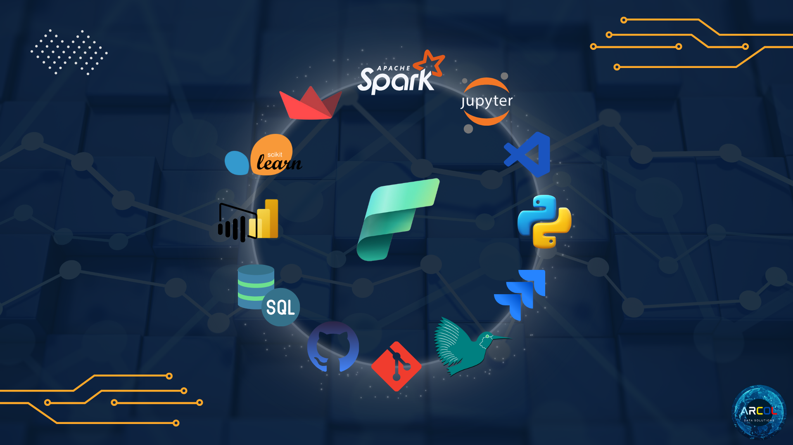
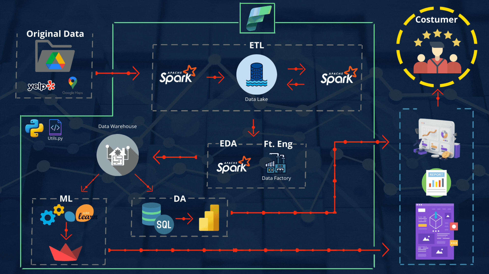
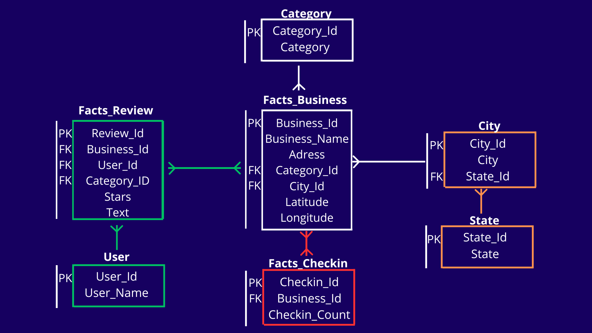
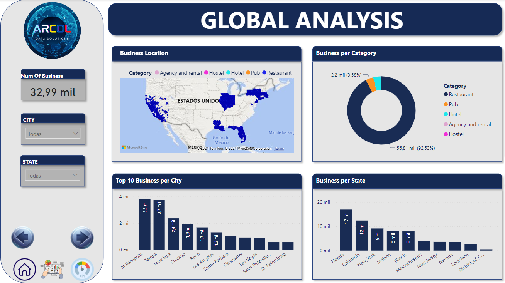
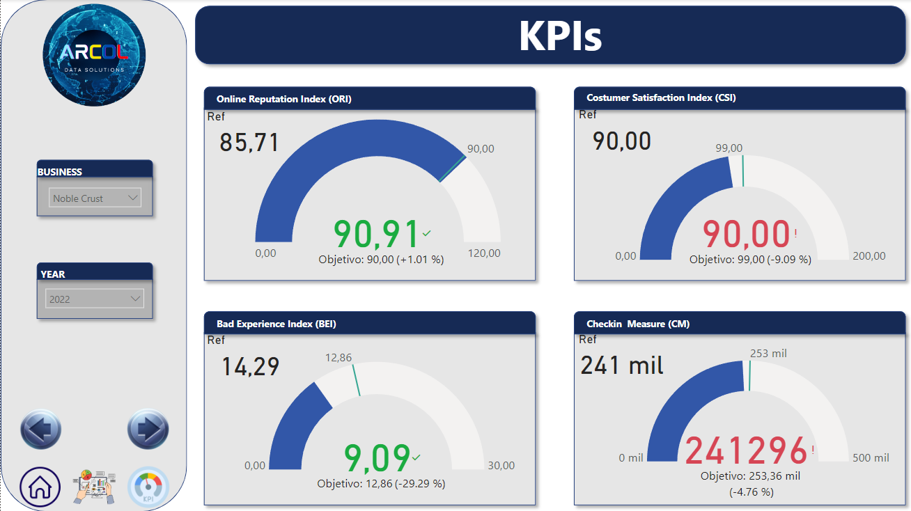
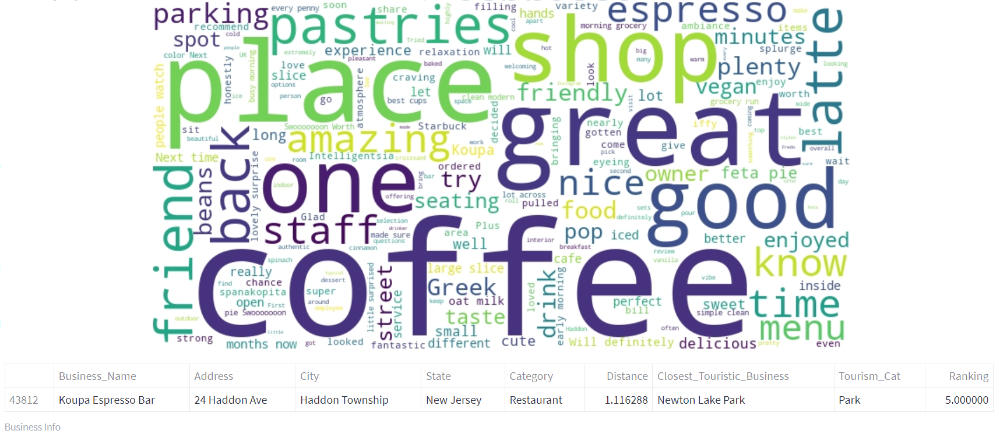

# Invesment_Recomendation_Project

  

## Descripción del Proyecto
Un cliente ha contratado los servicios de ARCOL Data Solutions y ha solicitado que se realice un análisis completo sobre el mercado de negocios turísticos en los Estados Unidos y crear una aplicación que presente un modelo de recomendación con el propósito de que los potenciales inversores interesados tengan información valiosa que les permita tomar decisiones sobre invertir o no, según sus necesidades.
Para ello, proporciona datos de las plataformas Yelp y Google Maps, a través de una carpeta en la nube de Google Drive que comparte con la empresa.

## Estructura del Proyecto

| Carpeta/Archivo          | Descripción                                                                                  |
| ------------------------ | -------------------------------------------------------------------------------------------- |
| **/data**                | Carpeta que almacena conjuntos de datos y archivos utilizados por el Análisis, el Dashboard y los modelos de ML.                              |
| **/Notebooks**           | Carpeta que contiene notebooks de Jupyter utilizados para procesos de ETL, EDA y ingeniería de características |
| **/Images**              | Carpeta que contiene imágenes relevantes e ilustrativas para el proyecto de análisis. |
| **/Docs**              | Carpeta que contiene archivos LaTex y PDF (en inglés y español) con la documentación realizada durante cada etapa del proyecto, así como un informe con el análisis final y el informe de conclusiones del proyecto.|
| **requirements.txt**           | Archivo que lista las dependencias y bibliotecas necesarias para ejecutar el proyecto. |
| **gitignore**            | Archivo que especifica carpetas y archivos a ignorar por el control de versiones (git).                      |
| **LICENSE**              | MIT LICENSE - Archivo que especifica los términos bajo los cuales se comparte el código fuente.                 |
| **main.py**                    | Archivo Python principal que sirve como punto de entrada para la aplicación y define la configuración y ejecución del modelo ML. |
| **README.md**            | Documentación principal del proyecto en inglés.                                                         |
| **README_ESP.md**        | Documentación principal del proyecto en español.                                                         |

## Autores

  

| Nombre                   | Rol                                       | |                |
| ------------------------ | ----------------------------------------- | -------------------------------- |--------------------------------|
| **Leonardo Cortés**      | Project Manager (PM) y Data Scientist    |[leocortes85](https://github.com/leocortes85/)  |[Leonardo Cortés Zambrano](https://www.linkedin.com/in/leonardo-cort%C3%A9s-zambrano/)
| **Marcelo Atencio**      | Task Manager y Data Engineer             |[MarceloAtencio](https://github.com/MarceloAtencio/) |[Marcelo Atencio](https://www.linkedin.com/in/marcelo-atencio/)
| **Federico López**       | Analista de Datos y Narrador de Historias de Datos.       |[alopezfederico](https://github.com/alopezfederico/) |[Federico Antonio López](https://www.linkedin.com/in/federico-a-lopez/)  |
| **Andrés Ruiz**          | Ingeniero de Datos e Ingeniero de ML     |[a1ternocles](https://github.com/a1ternocles) |[Andrés Ruiz](https://www.linkedin.com/in/andresruiz94/) |

## Trabajo Preliminar

Como trabajo preliminar, se carga los datos empresariales existentes en Google Maps y Yelp.
Con el fin de optimizar el tamaño de los archivos y el uso de recursos al trabajar con los datos, se realiza un cambio al formato parquet, optimizando el uso de recursos en un 69%.
Adicionalmente, se lleva a cabo un análisis preliminar de la calidad de los datos contenidos en los archivos.

## Stack Tecnológico

  

## Flujo de Tecnología

  

## Esquema de la Base de Datos
El Data Warehouse tiene un esquema de copo de nieve donde la tabla de hechos del negocio se utiliza como centro, las otras tablas proporcionan más información al analista al realizar consultas, pero solo si es necesario. Así, la base de datos es la siguiente:

  

## Transformaciones

- Se realizaron extracción, transformación y carga (ETL) utilizando la biblioteca Pandas automatizando un esquema de carga de datos desde la carpeta proporcionada por el cliente.
- Se aplicaron estrategias para manejar datos anidados y se eliminaron columnas irrelevantes o altamente nulas.
- Se llevó a cabo una carga incremental de información necesaria para complementar las tablas, basada en modelos de extracción con APIs externas, web scraping y formulación de funciones.

## Análisis Exploratorio de Datos (EDA)

- Se realizó un análisis exploratorio de datos (EDA) en conjuntos de datos transformados utilizando Pandas, Matplotlib y Seaborn.
- Se identificaron variables relevantes para crear los modelos de recomendación y relacionales.

## Tablas Dimensionales y Modelo Relacional

- Con las variables seleccionadas durante el análisis, se creó un modelo relacional con tablas dimensionales auxiliares, dos tablas de hechos y una tabla principal, con el fin de organizar la información y acceder a ella fácilmente.
- El modelo relacional se automatizó para trabajar con el Data Warehouse.

## Pipeline
Se creó y ejecutó un pipeline automatizado de datos para ejecutar el proyecto desde la base de datos proporcionada por el cliente hasta el Data Warehouse.

  <video width="640" height="360" controls>
    <source src="Images/Pipeline.mp4" type="video/mp4">
    Tu navegador no soporta la etiqueta de vídeo.
  </video>

## Proceso de Análisis de Datos

Desde el Data Warehouse, extraemos datos limpios y estructurados para realizar procesos de análisis de datos y ciencia de datos.

Para el proceso de Análisis de Datos, tomamos las tablas dimensionales y creamos un modelo semántico que relaciona las tablas entre sí para realizar un análisis específico en un Dashboard interactivo.

  

  

## Proceso de Machine Learning

Del mismo modo, utilizamos datos estructurados para realizar el proceso de Machine Learning, donde se proponen tres funciones para obtener los resultados deseados. Estas funciones toman uno o dos argumentos proporcionados por el usuario según su interés (Estado, Categoría) para elegir entre una serie de negocios recomendados con su información respectiva.

  

## Despliegue y Producto Final

Finalmente, se llevó a cabo el proceso necesario para entregar un producto final instalado en un sitio web con la herramienta Streamlit, donde el usuario puede encontrar toda la información correspondiente sobre ARCOL Data Solutions y, por supuesto, el panel interactivo y el modelo que recomendará negocios adaptados a sus intereses.

El producto final se puede ver [AQUÍ](https://arcolsolutions.streamlit.app/)

## Oportunidades de mejora

Algunas oportunidades de mejora identificadas en este proyecto, que se tienen planteadas como trabajo a futuro son:

- Realizar un bucle por medio de un enlace a las recomendaciones dadas por el modelo de ML realizado, para que el usuario pueda obtener la información tambien de cada uno de los negocios recomendados, mas allá del escogido por él mismo.
- Realizar un análisis mayor con cada KPI, donde se muestre no solo el resultado de la medición sino la información relevante a cada KPI.
- Agregar mayor información relevante del negocio (fotografias, ventas, etc) para dar una mejor herramienta de desición a un inversionista

## Dislcaimer

Este README proporciona una visión general del proyecto de Recomendación de Inversiones, destacando procesos y resultados clave. Para obtener información detallada sobre la implementación, consulte la documentación y el código fuente en el repositorio de GitHub. También puede acceder a la API y explorar la documentación en el enlace del producto final.
